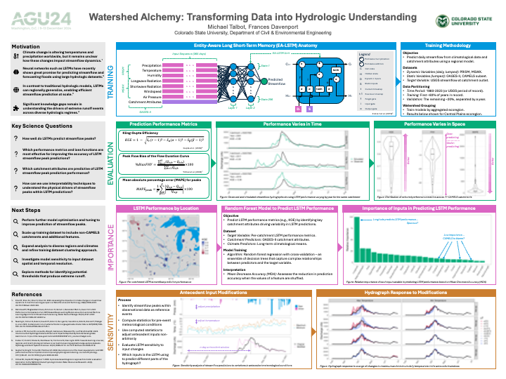

<a href="https://essopenarchive.org/users/857720/articles/1241515-watershed-alchemy-transforming-data-into-hydrologic-understanding" target="_blank">ESS Open Archive</a>

Recommended citation: 
<b>Talbot MT</b>. Watershed Alchemy: Transforming Data into Hydrologic Understanding. AGU24 Annual Meeting. Washington, D.C. Dec 13th, 2024.

