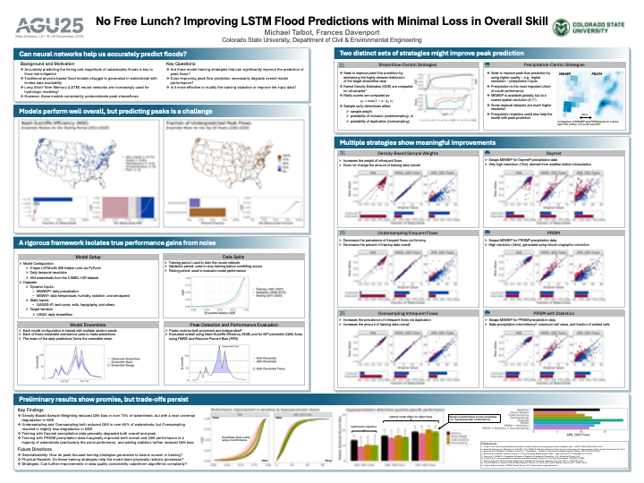

<a href="https://essopenarchive.org/users/857720/articles/1370403-no-free-lunch-improving-lstm-flood-predictions-with-minimal-loss-in-overall-skill" target="_blank">ESS Open Archive</a>

Recommended citation: 
<b>Talbot MT</b>. No Free Lunch? Improving LSTM Flood Predictions with Minimal Loss in Overall Skill. AGU25 Annual Meeting. New Orleans, Louisiana. Dec 15th, 2025. 

